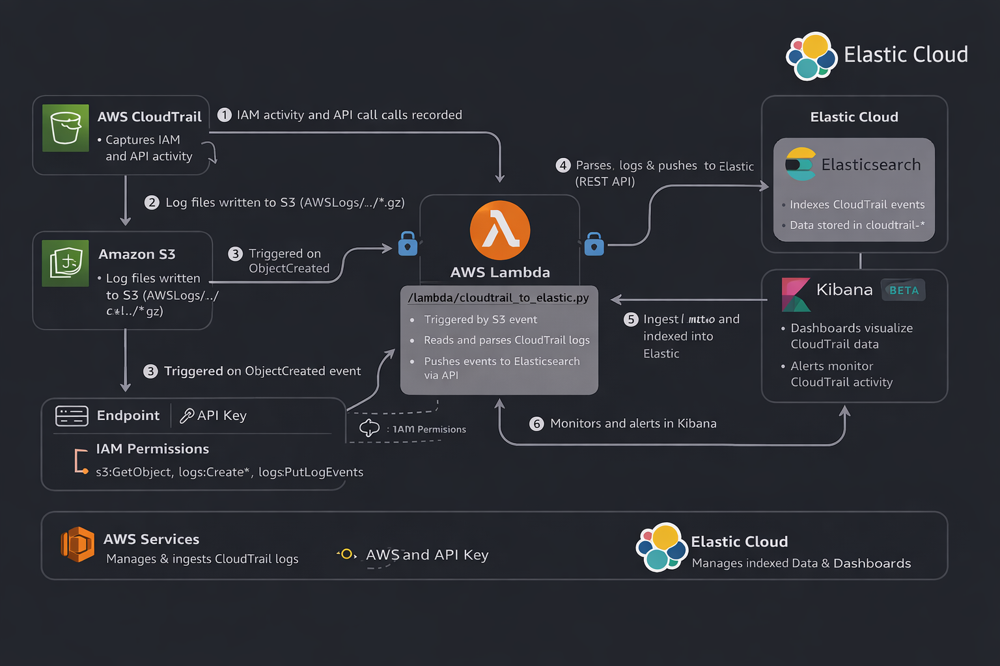
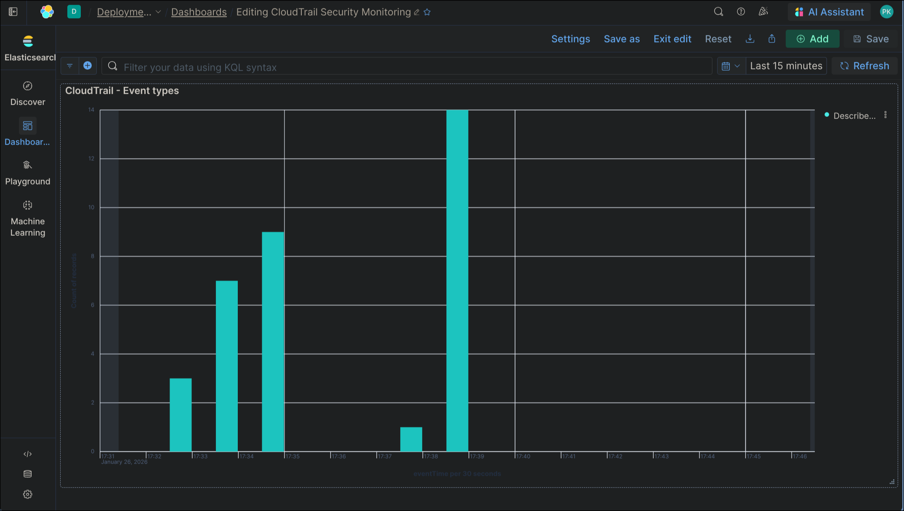
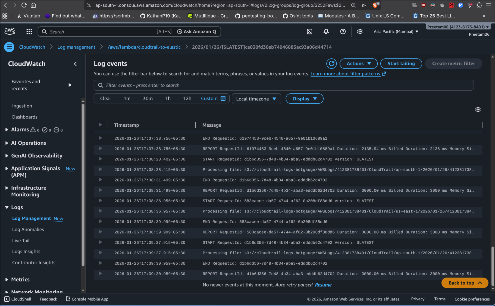
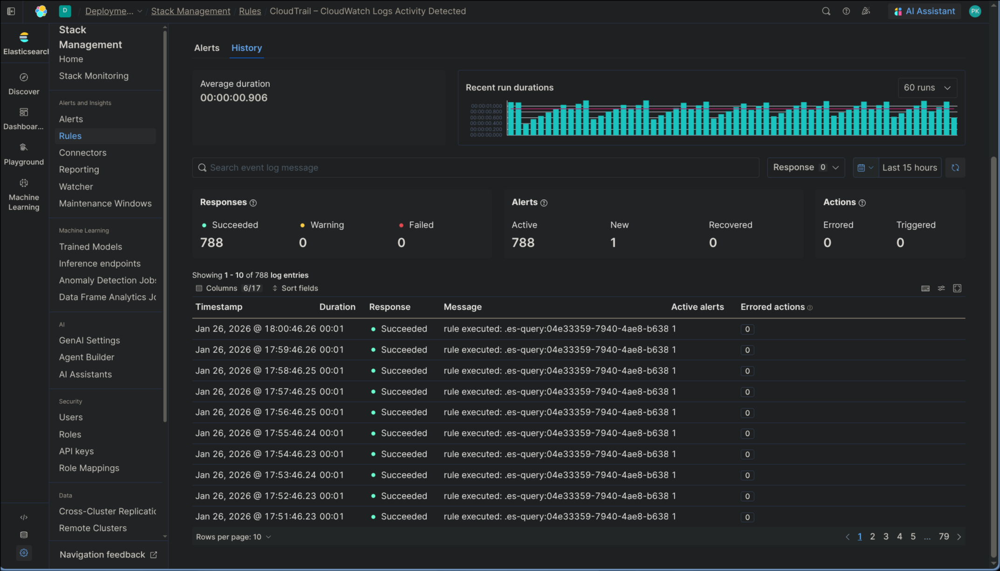
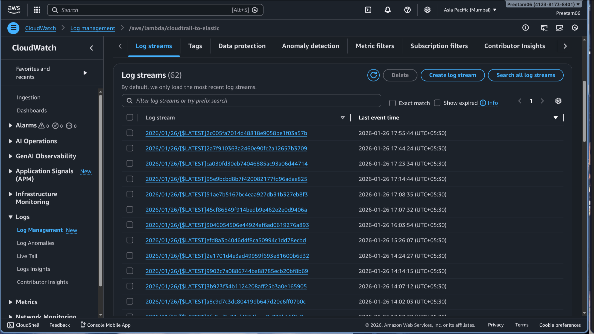

# AWS CloudTrail IAM Security Monitoring

[](https://www.python.org/downloads/)
[](https://aws.amazon.com/)
[](https://www.elastic.co/)
[](LICENSE)

A serverless security monitoring pipeline that detects and visualizes IAM-related security events in AWS using CloudTrail logs, AWS Lambda, and the Elastic Stack.

## Table of Contents

- [Overview](#overview)
- [Architecture](#architecture)
- [Features](#features)
- [Components](#components)
- [Getting Started](#getting-started)
  - [Prerequisites](#prerequisites)
  - [Deployment](#deployment)
- [Usage](#usage)
- [Screenshots](#screenshots)
- [Project Structure](#project-structure)
- [Validation](#validation)
- [Cost Considerations](#cost-considerations)
- [Limitations](#limitations)
- [Future Enhancements](#future-enhancements)
- [Contributing](#contributing)
- [Author](#author)

## Overview

This project implements a lightweight, serverless security monitoring solution for AWS IAM and CloudWatch activity. It processes CloudTrail logs in near real-time to detect potentially dangerous actions such as:

- IAM user creation (`CreateUser`)
- Policy attachment (`AttachUserPolicy`)
- Access key creation (`CreateAccessKey`)
- Unusual API activity from `logs.amazonaws.com`

The system provides comprehensive visibility into AWS account activity through Kibana dashboards and real-time alerting capabilities.

## Architecture



### Data Flow

1. **AWS CloudTrail** records all management events in your AWS account
2. **CloudTrail logs** are delivered to an Amazon S3 bucket
3. **S3 triggers** an AWS Lambda function upon new log file creation
4. **Lambda function** parses and processes CloudTrail JSON logs
5. **Parsed events** are indexed into Elasticsearch (Elastic Cloud)
6. **Kibana** provides dashboards and alert rules for visualization and anomaly detection

## Features

- **Real-time Monitoring**: Near real-time ingestion of CloudTrail events (1-5 minute latency)
- **Serverless Architecture**: No EC2 instances required - fully managed AWS services
- **IAM Security Focus**: Specifically monitors sensitive IAM operations
- **Interactive Dashboards**: Kibana visualizations for event analysis
- **Alert System**: Configurable rules to detect suspicious activity
- **Cost Efficient**: Uses only management events and free/trial tier services

## Components

### AWS Services
- **CloudTrail**: Captures AWS API activity
- **S3**: Stores CloudTrail log files
- **Lambda**: Processes logs and forwards to Elasticsearch
- **CloudWatch**: Monitors Lambda execution

### Elastic Stack
- **Elasticsearch**: Indexes and stores CloudTrail events
- **Kibana**: Provides dashboards and alerting capabilities

## Getting Started

### Prerequisites

- AWS account with appropriate permissions
- CloudTrail trail configured and delivering logs to S3
- Elastic Cloud account (free tier available)
- Python 3.9+ (for Lambda function)

### Deployment

1. **Clone the repository**
   ```bash
   git clone https://github.com/preetam/cloudtrail-iam-monitoring.git
   cd cloudtrail-iam-monitoring
   ```

2. **Deploy Lambda function**
   - Navigate to `lambda/` directory
   - Create a Lambda function in AWS Console
   - Upload `cloudtrail_to_elastic.py`
   - Set environment variables:
     ```
     ES_ENDPOINT=https://your-elasticsearch-endpoint
     ES_API_KEY=your-api-key
     ES_INDEX=cloudtrail-logs
     ```

3. **Configure S3 trigger**
   - Add S3 trigger for your CloudTrail bucket
   - Event type: `ObjectCreated`
   - Prefix: (optional, e.g., `AWSLogs/`)

4. **Set up Kibana**
   - Import dashboard from `kibana/dashboards/iam-activity-dashboard.json`
   - Create alert rules using `kibana/alerts/iam-anomaly-rule.md` as reference

## Usage

Once deployed, the system automatically:

1. Captures CloudTrail events when they arrive in S3
2. Processes and indexes events into Elasticsearch
3. Updates Kibana dashboards in near real-time
4. Triggers alerts based on configured rules

### Monitoring Activities

The system monitors these IAM-related activities:
- User management (`CreateUser`, `DeleteUser`, `UpdateUser`)
- Policy operations (`AttachUserPolicy`, `DetachUserPolicy`, `CreatePolicy`)
- Access key management (`CreateAccessKey`, `DeleteAccessKey`)
- CloudWatch Logs activity (`logs.amazonaws.com`)

## Screenshots


*Real-time IAM activity dashboard*


*CloudTrail event visualization*


*Alert rule execution*


*Lambda function execution logs*

## Project Structure

```
cloudtrail-iam-monitoring/
├── README.md                          # This file
├── architecture/
│   └── AWS_cloudtrail.png            # Architecture diagram
├── kibana/
│   ├── alerts/
│   │   └── iam-anomaly-rule.md       # Alert rule documentation
│   └── dashboards/
│       └── iam-activity-dashboard.json # Kibana dashboard export
├── lambda/
│   ├── README.md                     # Lambda function documentation
│   └── cloudtrail_to_elastic.py      # Lambda function code
├── report/
│   └── project-report.md             # Detailed project report
└── screenshots/
    ├── kibana-dashboard.png
    ├── cloudtrail-events.png
    ├── kibana-alert.png
    └── lamda-logs.png
```

## Validation

The system has been validated through:

1. **Event Generation**: Created IAM users and attached policies
2. **Log Capture**: Verified CloudTrail captured all events
3. **Lambda Execution**: Confirmed successful processing in CloudWatch Logs
4. **Indexing**: Validated events indexed in Elasticsearch
5. **Visualization**: Confirmed data appears in Kibana dashboards
6. **Alerting**: Tested alert rule execution

## Cost Considerations

To minimize costs during testing/demos:

- Only **management events** are enabled (no data events)
- **No EC2 instances** are required
- Uses **Elastic Cloud free/trial tier**
- Lambda invocations are minimal (only on CloudTrail log delivery)

**Estimated cost**: < $5/month for light usage

## Limitations

- No IAM data events (e.g., S3 object-level events)
- Alerts do not notify external systems (email/Slack)
- No ML-based anomaly detection
- Lambda deployment is manual (not infrastructure-as-code)

## Future Enhancements

- [ ] Enable selective data events
- [ ] Add Slack/email alert actions
- [ ] Implement IAM-specific anomaly detection
- [ ] Infrastructure provisioning using Terraform/CloudFormation
- [ ] Role-based dashboards for security teams
- [ ] Multi-region CloudTrail support

## Contributing

Contributions are welcome! Please follow these steps:

1. Fork the repository
2. Create a feature branch (`git checkout -b feature/amazing-feature`)
3. Commit your changes (`git commit -m 'Add amazing feature'`)
4. Push to the branch (`git push origin feature/amazing-feature`)
5. Open a Pull Request

## Author

**Preetam**
- B.Tech CSE | Cybersecurity & Cloud
- GitHub: [@preetam](https://github.com/preetam)
- LinkedIn: [Preetam](https://linkedin.com/in/preetam)

## License

This project is licensed under the MIT License - see the [LICENSE](LICENSE) file for details.

## Acknowledgments

- AWS CloudTrail documentation
- Elastic Stack community
- AWS Lambda best practices
